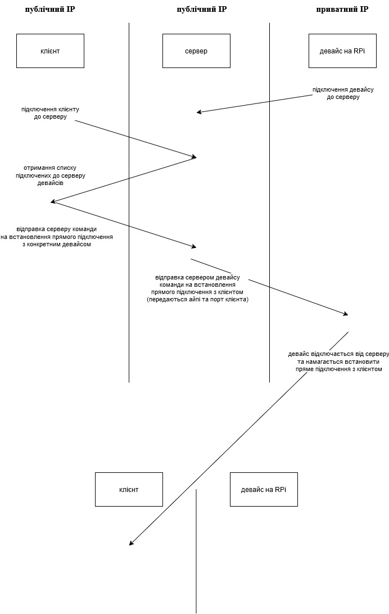
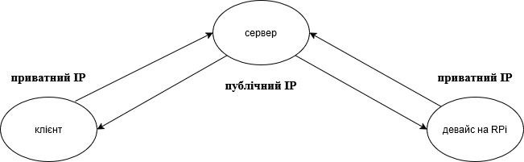

<h1>Віддалене керування камерою на RPi5</h1>

Репозиторій містить набір утиліт для віддаленої взаємодії з камерою на основі RaspberryPi

<h2>Сумісність</h2>
<table>
    <thead>
        <tr>
            <th>SBC\Камера</th>
            <th>Camera module 3</th>
            <th>Camera module 2</th>
        </tr>
    </thead>
    <tbody>
        <tr>
            <th>RPi5</th>
            <td>✅</td>
            <td>❓</td>
        </tr>
        <tr>
            <th>RPi4</th>
            <td>✅</td>
            <td>❌</td>
        </tr>
    </tbody>
</table>

<h2>Збирання</h2>

Для того щоб збілдити потрібну програму, виконується команда 
<code>make -C {dir name}</code> 
де dir name це назва директорії з програмою. 
Наприклад: 
<code>make -C servo_cam</code>

<h2>Принцип роботи</h2>

<b>Важливо</b> - у сервера завжди має бути публічна IP адреса. 
Робота данного набору програм заснована на техніці реверсивного підключення.  
- Навіщо? - Щоб мати можливість керувати віддаленим девайсом навіть якщо у нього приватний IP.  
- Чому саме реверсивне підключення? - Тому-що хост з публічним IP не може підключитися до хосту з приватним IP. Але хост з приватним IP може підключитися до хосту з публічним айпі. Тому саме девайс з підключається до клієнта, тому-що може бути необхідність розмістити девайс будь де і може не бути можливості надати девайсу публічний статичний IP, до якого клієнт завжди зможе підключитися. З іншого боку, сервер зобов'язаний мати публічний статичний IP, який буде прописаний у конфігурації девайсу як дефолтний - до якого девайс буде підключатися при запуску прошивки, або при подачі живлення.

<h3>У клієнта публічна IP адреса</h3>

В даному випадку сервер використовується як проміжна ланка для встановлення прямого підключення між клієнтом та девайсом для подальшого спілкування між ними.

<h3>У клієнта приватна IP адреса</h3>

В даному випадку сервер використовується як проксі для непрямого спілкування між клієнтом та девайсом.

<h1>Servo Cam</h1>

Програма надає можливість отримувати відео з камери, підключеної до RPi, та керувати положенням камери двома сервоприводами. Для роботи також потрібні клієнт та сервер з білим айпі.

<h2>Залежності</h2>
<table>
    <thead>
        <tr>
            <th>Назва</th>
            <th>Посилання</th>
        </tr>
    </thead>
    <tbody>
        <tr>
            <td>wiringPi</td>
            <td><a href=https://github.com/WiringPi/WiringPi/releases>link</a></td>
        </tr>
        <tr>
            <td>libconfuse</td>
            <td></td>
        </tr>
        <tr>
            <td>Клієнт та сервер</td>
            <td><a href=https://github.com/oleksandr-valentirov/remote_cam_app>link</a></td>
        </tr>
        <tr>
            <td><code>servo_cam/camera.py</code></td>
            <td>має бути скопійований у <code>/etc/servo_cam/camera.py</code></td>
        </tr>
    </tbody>
</table>

<h2>Конфіг-файл</h2>
<table>
    <thead>
        <tr>
            <th>Назва опції</th>
            <th>Опис</th>
            <th>Обов'язкова наявність</th>
        </tr>
    </thead>
    <tbody>
        <tr>
            <td>ip_addr</td>
            <td>IP адреса дефолтного сервера, до якого підключається програма після запуску</td>
            <td>так</td>
        </tr>
        <tr>
            <td>port</td>
            <td>Порт дефолтного сервера</td>
            <td>так</td>
        </tr>
        <tr>
            <td>name</td>
            <td>Ідентифікатор - ім'я, яке камера повідомляє серверу після підключення.  З цим іменем клієнт звертається до сервера з командою підключення камери.</td>
            <td>так</td>
        </tr>
    </tbody>
</table>

<h2>camera.py</h2>

Програма, що запускає камеру. 
Може бути використана напряму для стріму JPEG кадрів по UDP 
<code>camera.py --ip [target ip] --port [target port]</code> 
З простору С-коду запускається так само після створення дочірнього процесу системним викликом <code>fork</code>.

<h3>Залежності</h3>
<table>
    <thead>
        <tr>
            <th>Назва</th>
            <th>Посилання</th>
        </tr>
    </thead>
    <tbody>
        <tr>
            <td>picamera2</td>
            <td><a href="https://datasheets.raspberrypi.com/camera/picamera2-manual.pdf">link</a></td>
        </tr>
    </tbody>
</table>
